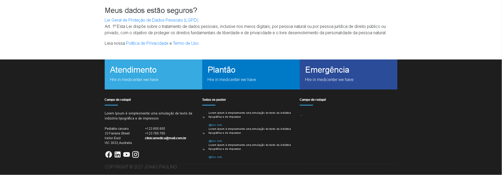
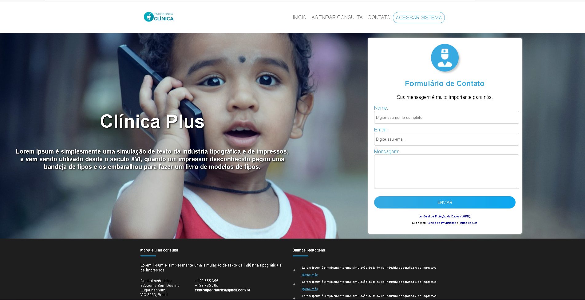
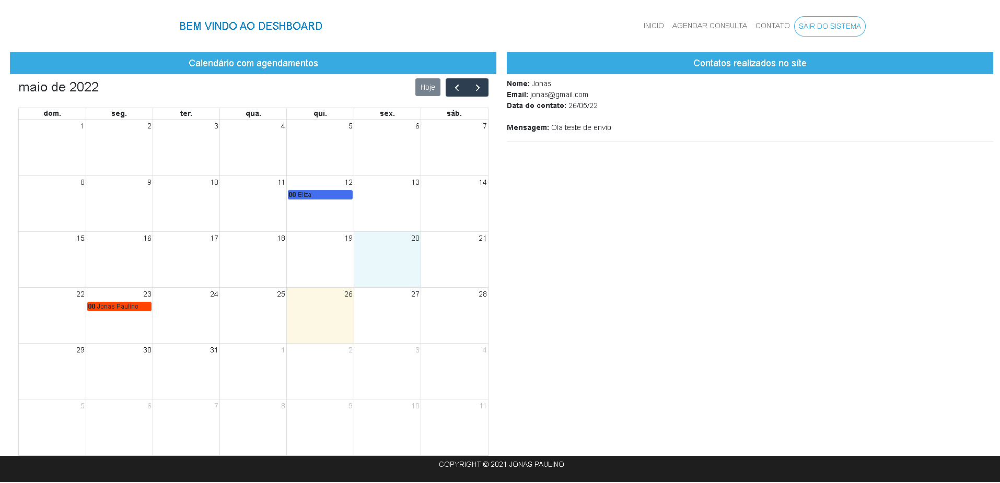
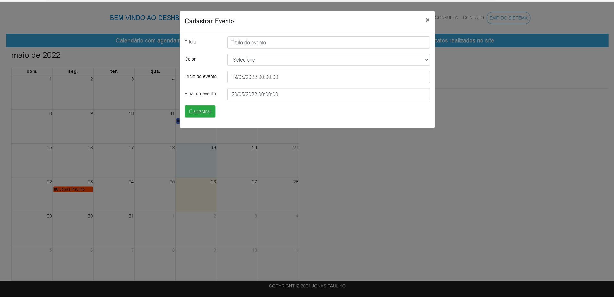
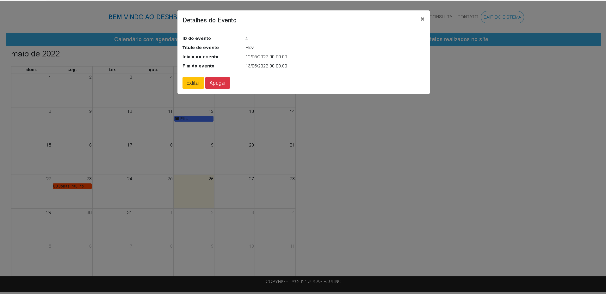

👋 Olá tudo bem? Sou Jonas Paulino, o professor solicitou um website com algumas funções em php.

✅ WebSite principal  
✅ Tela de contato  
✅ Agendamento  
✅ Tela de login  
✅ Main  
✅ Main com MasterCalendar  
✅ Main com lista de contatos realizados   

<h1>Algumas imagens do projeto</h1>
<h3>Tela inicial</h3>
  
<h3>Tela agendamento</h3>
  
<h3>Rodapé footer</h3>
 
<h3>Tela de contato</h3>
 
<h3>Tela login</h3>
 
<h3>Tela main</h3>
 
<h3>Modal cadastrar</h3>
 
<h3>Tela apagar</h3>
 

 
<h1>Baixe e divirta-se</h1>

Este foi o meu primeiro projeto tanto de website e utilizando php então perdoa ai a bagunça no código.
